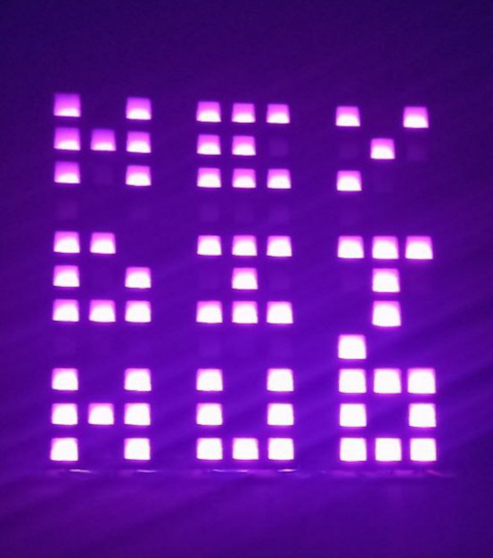

# LED Matrix Magic



Welcome to **LED Matrix Magic**! This project brings a 16x16 LED matrix to life using WS2812B LED strips, an ESP8266 microcontroller, and a slick web interface. This README will guide you through setting up and running your own LED matrix display.

## Table of Contents

- [Overview](#overview)
- [Features](#features)
- [Hardware Requirements](#hardware-requirements)
- [Software Requirements](#software-requirements)
- [Setup Instructions](#setup-instructions)
- [Usage](#usage)
- [Contributing](#contributing)
- [License](#license)
- [Gallery](#gallery)

## Overview

**LED Matrix Magic** is a project that transforms a 16x16 LED matrix into a customizable and interactive display. The project uses WS2812B LED strips controlled by an ESP8266 microcontroller, with a web-based interface to control individual LEDs.

## Features

- **Web Interface**: Control the LED matrix from any device with a web browser.
- **Paint Mode**: Choose any color to light up the LEDs.
- **Real-time Updates**: See changes in real-time as you interact with the interface.
- **Clean All Function**: Quickly reset the entire matrix to the default color.
- **Preset Effects**: Premade effects for the matrix.

## Hardware Requirements

- **ESP8266 Microcontroller**: Such as NodeMCU or Wemos D1 Mini.
- **WS2812B LED Strips**: Enough to create a 16x16 matrix (256 LEDs).
- **Plywood or other Base Material**: To mount the LEDs.
- **Power Supply**: Suitable for the number of LEDs (e.g., 5V 10A for 256 LEDs).
- **Miscellaneous**: Wires, connectors, soldering tools, etc.
- **3D Printed Parts**: Designed and printed to hold the LED strips and components. STL files are available in the `stl` folder.

## Software Requirements

- **Arduino IDE**: [Download here](https://www.arduino.cc/en/Main/Software).
- **FastLED Library**: Install via Arduino Library Manager.
- **ESPAsyncWebServer Library**: Install via Arduino Library Manager.
- **WebSockets Library**: Install via Arduino Library Manager.
- **ArduinoJson Library**: Install via Arduino Library Manager.

## Setup Instructions

1. **Clone the Repository**:
    ```sh
    git clone https://github.com/degradka/led-matrix-magic.git
    cd led-matrix-magic
    ```

2. **Open in Arduino IDE**:
    - Launch Arduino IDE.
    - Open `led-matrix-magic.ino` file from the cloned repository.

3. **Install Required Libraries**:
    - In Arduino IDE, go to **Sketch > Include Library > Manage Libraries**.
    - Install `FastLED`, `ESPAsyncWebServer`, `WebSockets`, and `ArduinoJson` libraries.

4. **Configure WiFi Credentials**:
    - Update the following lines in `led-matrix-magic.ino` with your WiFi credentials:
      ```cpp
      const char* ssid = "your_SSID";
      const char* password = "your_PASSWORD";
      ```

5. **Upload the Code**:
    - Connect your ESP8266 to your computer.
    - Select the appropriate board and port from **Tools** menu.
    - Click the **Upload** button.

6. **Connect the Hardware**:
    - Connect the WS2812B LED strips to the ESP8266 (Data pin to D4, 5V, and GND).
    - Ensure the power supply is correctly connected to both the LEDs and the ESP8266.

## Usage

1. **Power on the ESP8266** and wait for it to connect to your WiFi network.
2. **Open a web browser** and enter the ESP8266’s IP address (displayed in the Serial Monitor).
3. Use the **web interface** to control the LED matrix:
    - Use the color picker to select your desired color.
    - Click on any pixel to change its color.
    - Click the "Clean All" button to reset the matrix.
    - Check out the premade effects by pressing the buttons under "Preset Effects".

## Gallery

Here are some images of the project in action:

### Schematic


### Website Controller


## Contributing

Contributions are welcome! Please fork the repository and submit a pull request for any improvements or bug fixes.

## License

This project is licensed under the MIT License - see the [LICENSE](LICENSE) file for details.

---